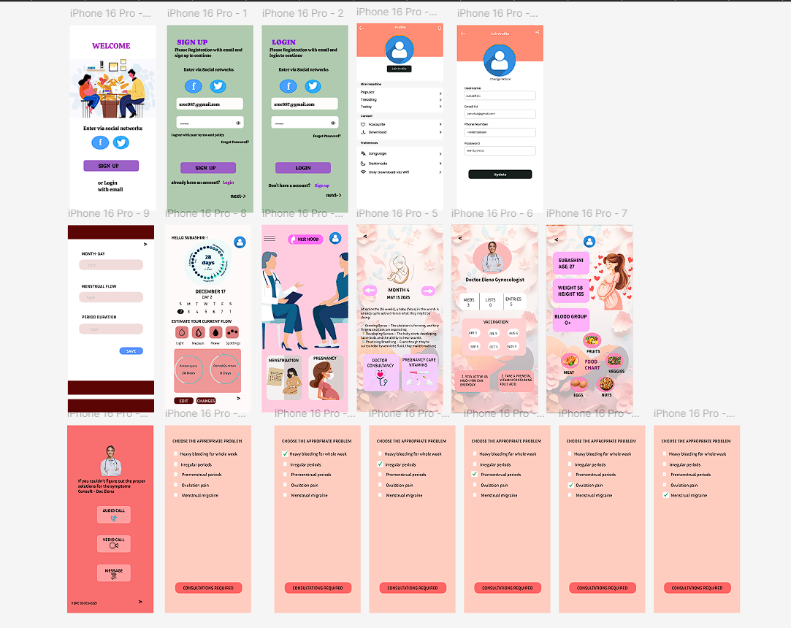
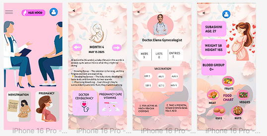
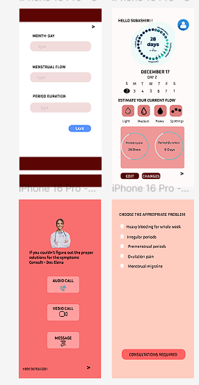
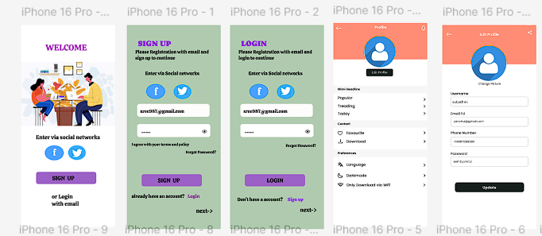

# Her Hood - Figma UI/UX Project

## 🔗 Figma Prototype
[Click here to view the design](https://www.figma.com/design/LsJZeBmBUcyNVhryEmllVw/Her-Hood?node-id=0-1&t=6J880AGFr1NxW2lo-1)

## 📌 About
Her Hood is a UI/UX design focused on creating a safe digital platform for women.

## 🛠 Tool Used
- Figma

## ✨ Features
- Clean UI design
- User-friendly navigation
- Community-based concept

- ## 📸 Screenshots
- ## 🎥 Demo Video
[Click here to watch demo](https://drive.google.com/drive/folders/1Qa8Sf34d3XKp9n5bi2JtDfLBVaG0L8H1?usp=sharing)

   
   
   
   

  

